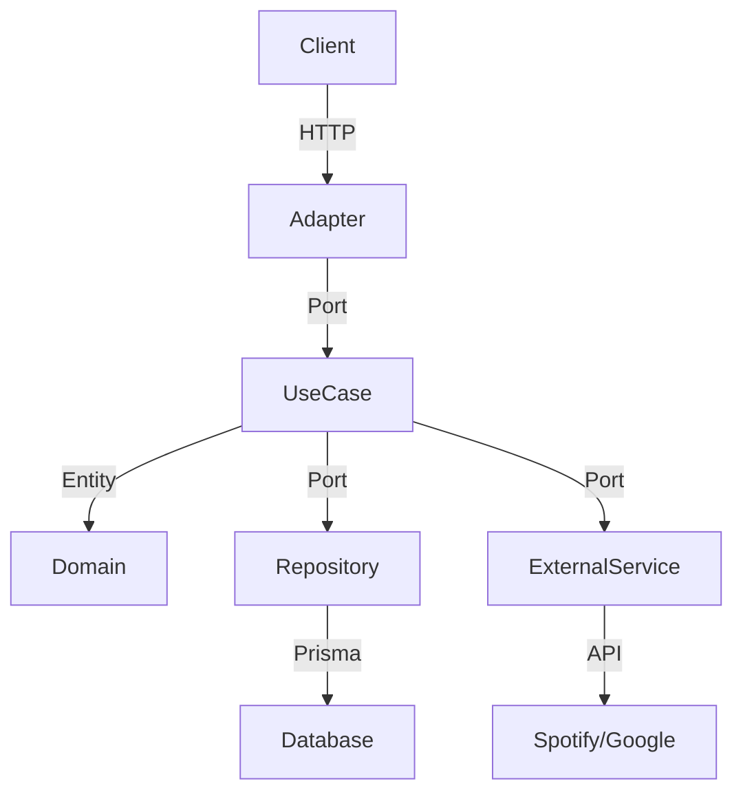

import { Callout } from "nextra/components";
import { FileTree } from "nextra/components";

# Arquitetura do Sistema

O Harmonia.io é construído com foco em escalabilidade, testabilidade e independência tecnológica, adotando os princípios da **Clean Architecture** e **Ports & Adapters**. O núcleo da aplicação permanece desacoplado de frameworks, bancos de dados e integrações externas, facilitando evolução e manutenção.

## Visão Geral do Monorepo

O projeto utiliza o Turborepo para orquestrar múltiplos pacotes e aplicações:

## File Tree (Core)

<FileTree>
  <FileTree.Folder name="apps" defaultOpen>
    <FileTree.Folder name="api" defaultOpen>
      <FileTree.Folder name="src" defaultOpen>
        <FileTree.Folder name="domain" />
        <FileTree.Folder name="application" />
        <FileTree.Folder name="infrastructure" />
        <FileTree.Folder name="main" />
        <FileTree.Folder name="types" />
      </FileTree.Folder>
    </FileTree.Folder>
    <FileTree.Folder name="web">
      <FileTree.Folder name="app" defaultOpen>
        <FileTree.Folder name="docs" />
        <FileTree.Folder name="dashboard" />
        <FileTree.Folder name="login" />
        <FileTree.File name="..." />
      </FileTree.Folder>
    </FileTree.Folder>
  </FileTree.Folder>
  <FileTree.Folder name="packages">
    <FileTree.Folder name="database" />
    <FileTree.Folder name="shared" />
  </FileTree.Folder>
  <FileTree.File name="docker-compose.yml" />
  <FileTree.File name="Dockerfile" />
  <FileTree.File name="package.json" />
  <FileTree.File name="README.md" />
</FileTree>

## Camadas da API

<Callout type="default">
  <b>Domain</b>: Entidades e regras de negócio puras. Sem dependências externas.
   
  <b>Application</b>: Casos de uso (Use Cases) e Interfaces (Ports). Orquestra o
  fluxo de dados entre camadas.
   
  <b>Infrastructure</b>: Implementações concretas (Adapters). Inclui Express,
  Prisma, BullMQ, e integrações com Spotify/Google.
</Callout>

### Fluxo de Dados

1. **Request** chega via HTTP (Express ou Next.js API Route)
2. **Adapter** converte dados e chama um caso de uso (Application)
3. **Use Case** executa lógica, acessa entidades (Domain) e depende de interfaces (Ports)
4. **Ports** são implementados na Infrastructure (ex: repositórios, serviços externos)
5. **Response** retorna ao Adapter, que envia ao cliente

### Exemplo de Integração

## Decisões Técnicas

- **Inversão de Dependência**: A camada de infraestrutura conhece a aplicação, nunca o contrário.
- **Testes**: Casos de uso e entidades podem ser testados isoladamente, sem mocks de frameworks.
- **Extensibilidade**: Novos provedores ou integrações podem ser adicionados criando novos adapters e ports.

## Frontend

O frontend (apps/web) utiliza Next.js 15, com rotas e páginas organizadas em `app/`, componentes reutilizáveis em `components/`, e estilos com Tailwind CSS. A comunicação com a API é feita via REST, e o contexto de autenticação é gerenciado por hooks e providers.

---

<Callout type="info">
  Para detalhes sobre cada módulo, consulte a documentação específica de{" "}
  <b>API</b>, <b>Web</b> e <b>Database</b>.
</Callout>
